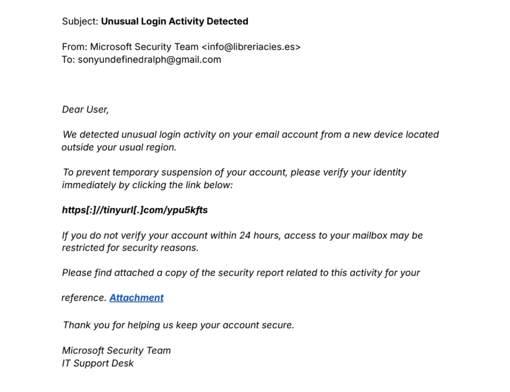
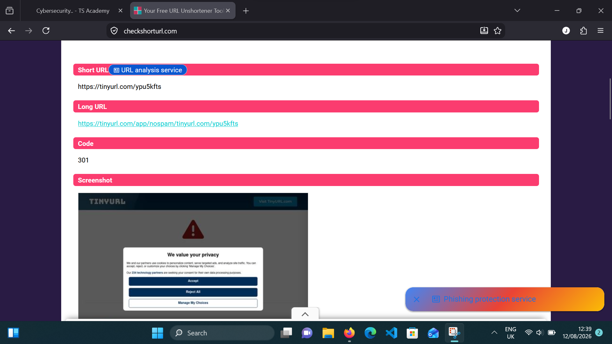
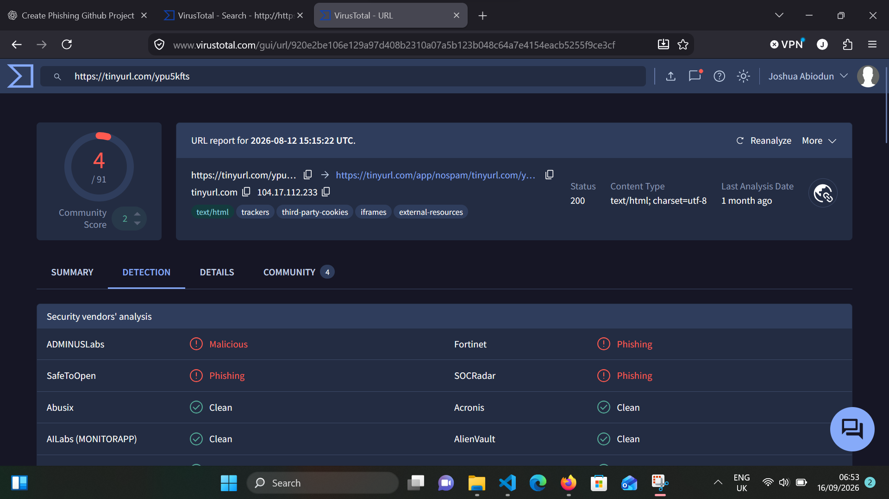
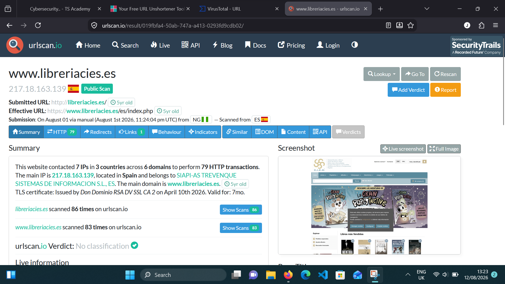

# Phishing Email Investigation

## Overview

This project documents a SOC-style investigation of a suspected phishing email claiming to be from the Microsoft Security Team.

## Scenario

The email claims that unusual login activity was detected and urges the recipient to verify their identity within 24 hours.


## Original Phishing Email

The following screenshot shows the suspicious email analyzed during the investigation.




## Investigation Objectives

- Identify Indicators of Compromise (IOCs)
- Investigate the sender and recipient addresses
- Analyze the sender domain
- Safely investigate the embedded URL
- Determine whether the email is a phishing attempt

## Tools Used

- VirusTotal
- DNSDumpster
- URLScan
- CheckShortURL

## 1. IOC Identification

| IOC | Value | Type | Finding |
|---|---|---|---|
| Sender | `info@libreriacies.es` | Email | Suspicious |
| Domain | `libreriacies[.]es` | Domain | Suspicious |
| URL | `tinyurl.com/ypu5kfts` | URL | Suspicious |
| Recipient | `[redacted]` | Email | Victim |

## 2. Email Address Investigation

**Sender email address:** `info@libreriacies.es`

The email claims to be from the **Microsoft Security Team**, but the sender is using the domain `libreriacies.es`, which does not match Microsoft's official domain.

This mismatch between the claimed organization and the sender's domain is a strong indicator that the email is suspicious and may be part of a phishing attempt.

## 3. Domain Analysis

The sender's domain is `libreriacies[.]es`. The email claims to be from the **Microsoft Security Team**, but the sender's domain does not match Microsoft's official domain.

This domain mismatch is a strong indicator of impersonation and makes the email suspicious.

## 4. URL Analysis

The embedded URL was analyzed safely without directly clicking or visiting the link.

The shortened URL was first analyzed using CheckShortURL to examine the URL and its redirection behavior.



VirusTotal identified **4 security vendors out of 92** that flagged the URL. The detections included **1 Malicious** classification and **3 Phishing** classifications.



URLScan was also used to investigate the URL and associated domain infrastructure.



Based on the available URL reputation and analysis results, the embedded link is considered **suspicious and potentially malicious**.

## 5. Phishing Assessment

**Yes, this email is a phishing email.**

The email impersonates the **Microsoft Security Team** but originates from an unrelated domain, `libreriacies[.]es`. It also contains a shortened URL, uses urgency, and threatens account restrictions if the recipient does not verify their identity within 24 hours.

These are strong indicators of a phishing attempt.

Based on the findings from the email, domain, and URL analysis, the incident is classified as a **phishing attempt**.

## Key Findings

- The sender claims to be the **Microsoft Security Team**, but the email originates from the unrelated domain `libreriacies[.]es`.
- The email contains a **shortened TinyURL link**, which was analyzed without directly clicking it.
- **4 out of 92 VirusTotal security vendors flagged the URL**, including 1 Malicious detection and 3 Phishing detections.
- URL analysis identified infrastructure associated with `libreriacies.es`.
- The email uses **urgency and a 24-hour deadline** to pressure the recipient into verifying their identity.
- The message threatens **account restrictions** if the recipient does not take action.
- Based on the combined findings, the email was classified as a **phishing incident**.

## Skills Demonstrated

- Phishing analysis
- IOC identification
- Email investigation
- Domain investigation
- URL analysis
- Threat intelligence
- DNS analysis
- SOC incident response

## Repository Structure
```
phishing-email-investigation/
├── README.md
└── screenshots/
    ├── original_phishing_email.png
    ├── check_short_url.png
    ├── virustotal_url_analysis.png
    └── urlscan_analysis.png
```


## Author

[](https://www.linkedin.com/in/joshua-mayowa-773bb7375)

[](https://x.com/sudomayor)